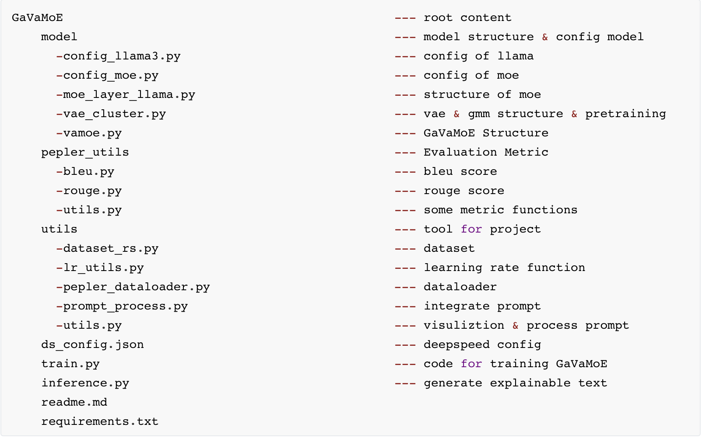

# GaVaMoE: Gaussian-Variational Gated Mixture of Experts for Explainable Recommendation

## GaVaMoE Project 


## Datasets to [Download](https://github.com/lileipisces/PEPLER?tab=readme-ov-file#datasets-to-download)

- TripAdvisor Hong Kong
- Amazon Movies & TV
- Yelp 2019

## Code dependencies

```python
pip install -r requirements.txt 
```

## Usage for GaVaMoE 

### Modify the config

- 1、replace ‘dataset’: ex: TripAdvisor， Amazon，Yelp.

- 2、make ‘dataset’ folder in the root content, modify the ‘data_path’ and ‘index_dir’.

 

- 3、replace ‘pretrain_model_path’  and ‘pretrain_weight_save’，you can create a new folder named 'output' in the root content. Then, replace 'output_dir', just like this: './output/dataset/', dataset means dataset name you named.
- 4、if you wanna use deepspeed， please add the config path on the **train function** in the **train.py**.
- 5、modify **moe_layer_llama.py**, set num_cluster equals arg's num_cluster.

### Training 

use below script to train GaVaMoe.

```python
export CUDA_VISIBLE_DEVICES=0
python train.py
```

or you can use deepspeed:

```python
deepspeed --num_gpus 1 train.py 
```

### Inference

Please modify some config in inference.py, just like this:

Make new folder called excel in your root. The dataset path need to map the dataset to huggingface format.

```python
vae_model_path = './output/Yelp_Cluster4/Yelp_Cluster4_cluster_4_epoch_20.pth'
llm_model_path = './output/Yelp_Cluster4/explain'
data_path      = './dataset/cache/test_dataset_Yelp'
excel_path     = './excel/yelp/llama_yelp_cluster4.xlsx'
txt_path       = './excel/yelp/llama_yelp_cluster4.txt'
num_cluster    = 4 
```

**num_cluster equals to config's num_cluster.**

```python
python inference.py
```
